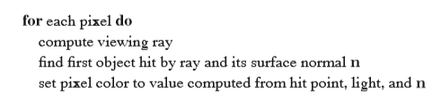

##光线追踪

计算机图形学的基本任务之一：渲染三维物体，并产出特定视角下的二维图像。

渲染就是把物体按不同的贡献输出成像素。

有两种方法，1.object-order：遍历物体去生成像素。2.image-order：遍历像素去计算物体的贡献。

2更灵活，但一般花更长时间。

光线追踪是一种2算法。一次计算一个像素的位置所能看到的物体的景象。从它发出viewing ray 碰到盖住了其它物体的物体时，进行shading计算，决定像素的颜色。

三维物体投射到二维图像有两种方式：正交，透视。

###一、计算viewing ray

找到起点e和终点s即可确定viewing ray：p(t)=e + t(s−e).  

viewing rays 从u和v决定的面板上开始。u，v，w组成一个右手坐标系。

以正交/透视两种方式投射在范围为[l,r]，[b,t]的图像上。

像素在图像上的位置对应到uv坐标系上的计算公式（4.1）为：

正交方式获得图像上某像素的viewing ray的过程：

透视：

###二、ray与物体相交

确定viewing ray:e+td后，继续找第一个相交的物体。

给定一个满足f(p)=0的面板，那么与viewing ray的相交点满足f(e+td)=0或f(p(t))=0。

1.球形（p76）

对于一个以点c为球心的球形面板，对于任何在面上的点p有

代入viewing ray：

解得：

2.三角形（p77）

3.多边形（p80）

### 三、Shading

一旦像素确定后，由shader计算像素的值。大多数shader是被用于抓取物体表面被光照亮并反射回相机的光反射过程。光反射中重要的两个变量：指向光源的方向变量l，

